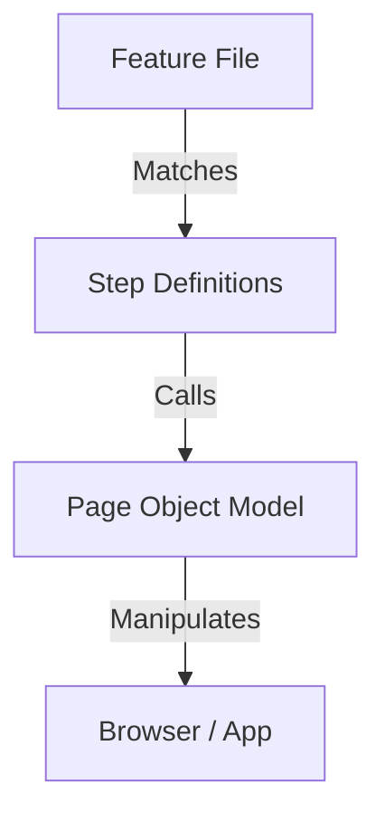
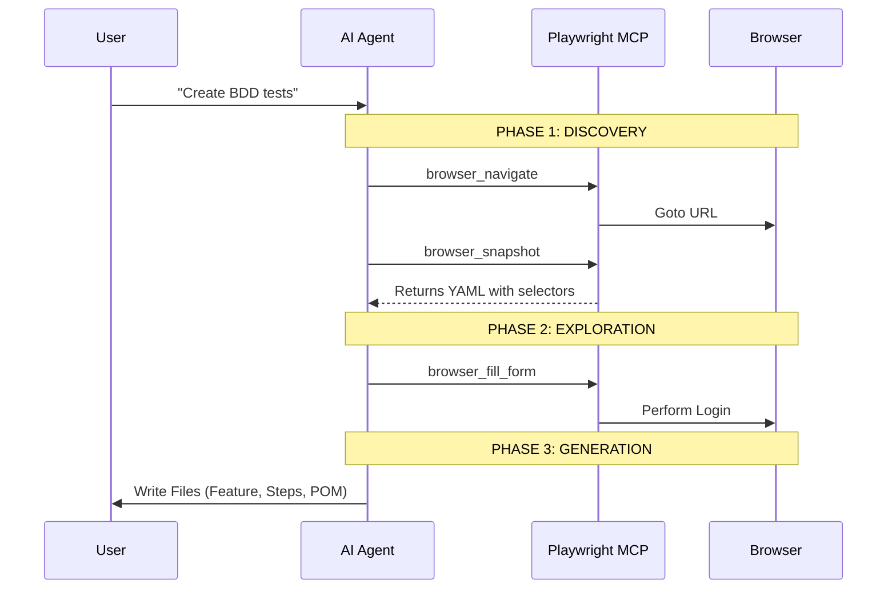
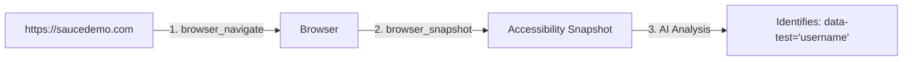
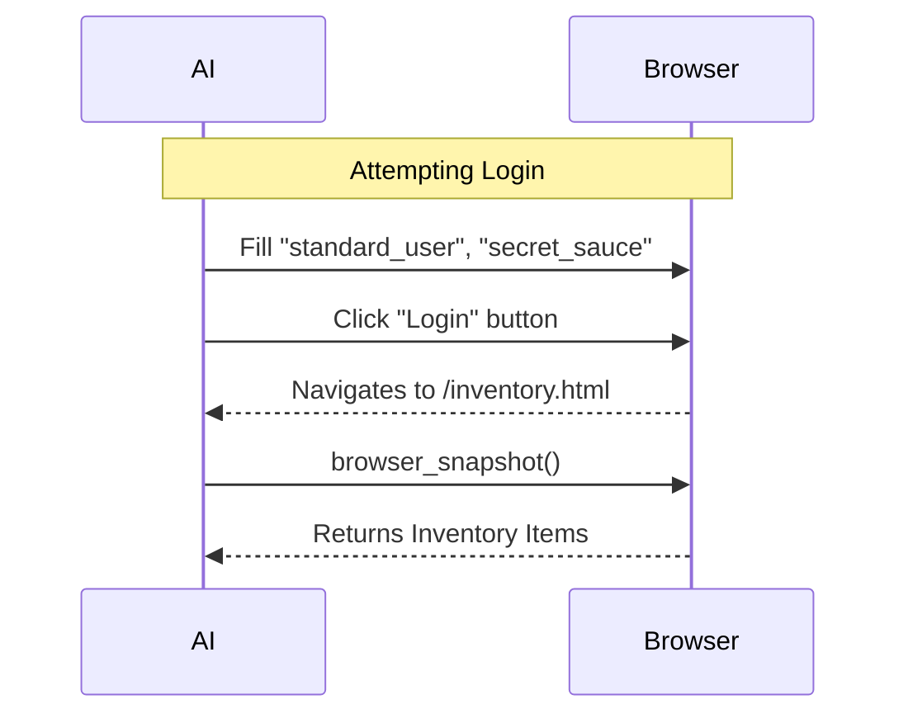
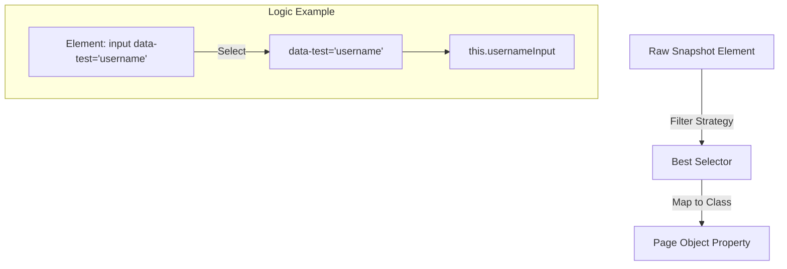
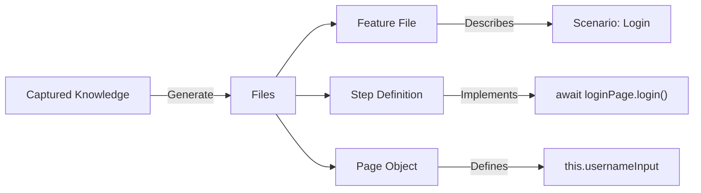
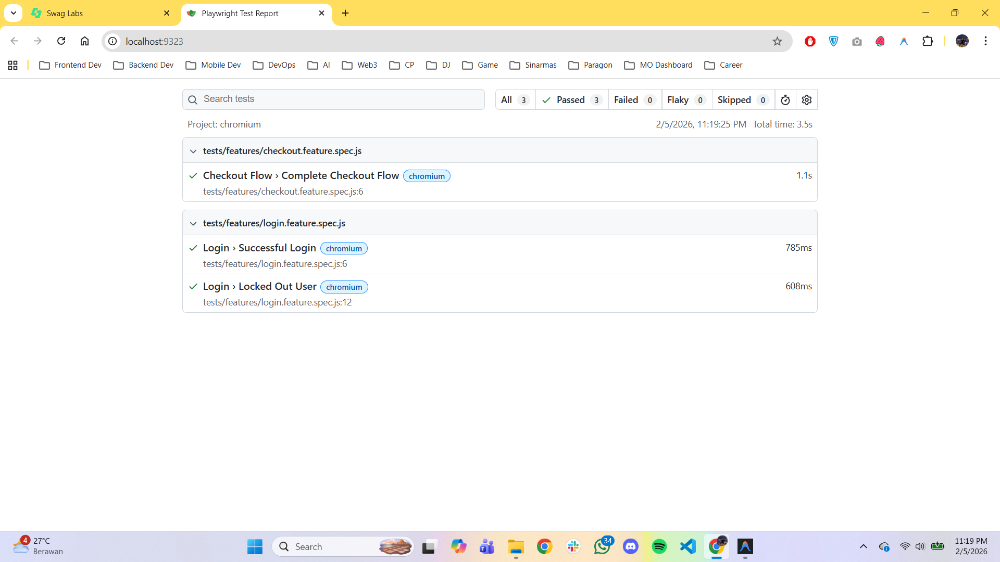
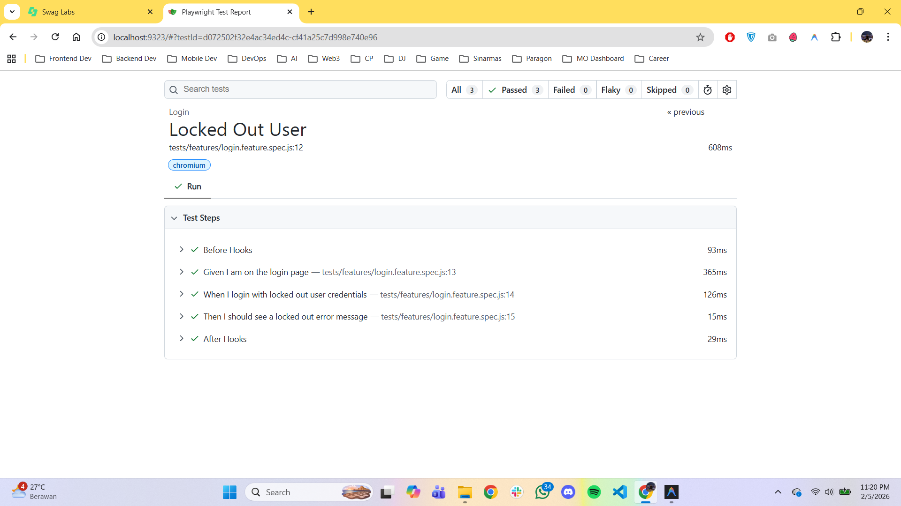

# Playwright MCP & BDD: End-to-End Guide

This guide explains how we used the **Playwright MCP Server** to autonomously plan and implement a **Behavior Driven Development (BDD)** test suite for SauceDemo.

## 1. Introduction: What is Playwright MCP?

The **Model Context Protocol (MCP)** for Playwright acts as the "eyes and hands" of the AI agent.

-   **Eyes (Inspect)**: The agent can "see" the web page structure (snapshots) to identify selectors.
-   **Hands (Interact)**: The agent can click, type, and navigate to explore the application flow.

**Why is this powerful?**
Instead of guessing selectors or asking you to copy-paste HTML, the AI explicitly explores the application to ensure the code it writes is accurate and functional from the start.

---

## 2. Why Playwright MCP? (A Comparison)

Traditional coding assistants are blind; they only see your code. Playwright MCP gives the AI "eyes" to see the actual application.

| Feature | ❌ Traditional AI / Manual | ✅ Playwright MCP |
| :--- | :--- | :--- |
| **Context** | AI guesses based on file names or user description. | AI **sees** the real page structure via snapshots. |
| **Selectors** | Often uses fragile XPaths or CSS changes. | Prioritizes engineering-safe attributes (`data-test`, `id`). |
| **Verification** | "Write and Pray" (Run code to see if it fails). | **"Interact then Write"** (AI logs in and verifies flow first). |
| **Effort** | User must copy-paste HTML specific parts to AI. | AI explores the entire DOM autonomously. |

### Real-World Example: "Refactoring a Login Page"
*   **Without MCP**: You change the login button's class from `.btn-blue` to `.btn-green`. Your old AI-generated test (`page.locator('.btn-blue')`) breaks.
*   **With MCP**: The AI inspects the page, ignores the class change, and confirms the `data-test="login-button"` is still present. It writes code that is immune to visual refactors.

---

## 3. Installation & Setup

To use Playwright with an AI agent via MCP, you need to run the MCP server.

### Prerequisites
- Node.js (v18 or higher)
- Playwright browsers installed (`npx playwright install`)

### Running the Server
The Playwright MCP server can be run directly using `npx`:

```bash
npx -y @modelcontextprotocol/server-playwright
```

### Configuring Your AI Client
If you are using an MCP-compatible client (like Claude Desktop or a custom agent), you need to add the server to your configuration:

```json
{
  "mcpServers": {
    "playwright": {
      "command": "npx",
      "args": [
        "-y",
        "@modelcontextprotocol/server-playwright"
      ]
    }
  }
}
```

Once configured, the `browser_*` tools (navigate, click, snapshot, etc.) will become available to the AI.

---

## 4. Understanding BDD (Behavior Driven Development)

We implemented a BDD framework using `playwright-bdd`.

### Core Concepts
1.  **Feature File (`.feature`)**: Describes *what* the application should do in plain English (Gherkin syntax).
    *   *Example*: "Given I am on the login page..."
2.  **Step Definitions (`.steps.ts`)**: The glue code that links Gherkin lines to actual code logic.
3.  **Page Object Model (POM)**: The implementation layer. Classes that wrap page selectors and actions (`LoginPage`, `InventoryPage`).

### The Architecture
The AI uses this triangle of separation to create maintainable tests:



---

## 5. The Workflow: From Request to Code

Here is the exact step-by-step process we used to build the SauceDemo suite.



### Step 1: Discovery (The "Eyes")

The goal of this phase is to "see" the page structure without needing to download the entire HTML source code.

**How it works:**
1.  **Navigation**: The AI uses `browser_navigate` to open the URL.
2.  **Snapshotting**: The AI calls `browser_snapshot`. This helps the AI by converting the complex DOM into a simplified list of interactive elements (like inputs, buttons, and links).

**Visual Flow:**



**Why this is better:**
The snapshot filters out noise (like `<div>` wrappers for styling) and focuses purely on what a user can interact with, making selector discovery much more accurate.

---

### Step 2: Interaction (The "Hands")

Static analysis isn't enough. To write a "Checkout" test, the AI must actually **do** the checkout to find the hidden fields.

**How it works:**
1.  **Action**: The AI uses `browser_fill_form` inputs and `browser_click` maps to perform the login.
2.  **Reaction**: The browser navigates to the Inventory page.
3.  **Validation**: The AI takes a new snapshot to confirm it has arrived at the correct page.

**Interaction Loop:**



---

### Step 3: Synthesis (The "Brain")

This is where the "Intelligence" happens. The AI doesn't just copy the first selector it sees. It evaluates the snapshot to find the **most robust** strategy.

**The Decision Process:**
*   **Bad Selector**: `id="user-name"` (Might change)
*   **Okay Selector**: `input[name="user-name"]`
*   **Best Selector**: `data-test="username"` (Designed for testing)

**Mapping Process:**



---

### Step 4: Code Generation (The "Output")

Finally, the AI compiles the knowledge (user flows + robust selectors) into the actual files. It splits the logic into the BDD "Triangle".

**Generation Flow:**



**Result:** The generated code is standard Playwright code. It has no dependency on the MCP server and can be run in any CI/CD environment.

---

## 6. Sample Code Generated via MCP

Here is a more complex example: **The Checkout Flow**. This demonstrates how the AI handles forms, multiple interactions, and assertions.

### A. The Input (Snapshot of Checkout Page)
*From a `browser_snapshot` call on `/checkout-step-one.html`:*
```yaml
- generic:
  - textbox "First Name" [ref=e143]
    - attribute: data-test="firstName"
  - textbox "Last Name" [ref=e145]
    - attribute: data-test="lastName"
  - textbox "Zip/Postal Code" [ref=e147]
    - attribute: data-test="postalCode"
  - button "Continue" [ref=e152]
    - attribute: data-test="continue"
```

### B. The Output (Complex Page Object)
The AI maps these inputs to a reusable class with a helper method `fillInformation`.

**`tests/pages/CheckoutPage.ts`**
```typescript
import { Page, Locator } from '@playwright/test';

export class CheckoutPage {
  readonly page: Page;
  readonly firstNameInput: Locator;
  readonly lastNameInput: Locator;
  readonly postalCodeInput: Locator;
  readonly continueButton: Locator;

  constructor(page: Page) {
    this.page = page;
    // Direct mapping from snapshot attributes
    this.firstNameInput = page.locator('[data-test="firstName"]');
    this.lastNameInput = page.locator('[data-test="lastName"]');
    this.postalCodeInput = page.locator('[data-test="postalCode"]');
    this.continueButton = page.locator('[data-test="continue"]');
  }

  // Complex action method generated by AI
  async fillInformation(firstName: string, lastName: string, zip: string) {
    await this.firstNameInput.fill(firstName);
    await this.lastNameInput.fill(lastName);
    await this.postalCodeInput.fill(zip);
    await this.continueButton.click();
  }
}
```

### C. The Logic (Parameterized Step Definitions)
The AI handles the Gherkin parameter passing `{string}` to drive the data.

**`tests/steps/checkout.steps.ts`**
```typescript
import { When } from '../fixtures';

When('I fill in my information with {string}, {string}, {string}', 
  async ({ checkoutPage }, firstName: string, lastName: string, zip: string) => {
    // The step definition delegates the complex data entry to the POM
    await checkoutPage.fillInformation(firstName, lastName, zip);
});
```

### D. The Behavior (Full Feature)
**`tests/features/checkout.feature`**
```gherkin
Scenario: Complete Checkout Flow
    Given I am logged in
    When I add "Sauce Labs Backpack" to the cart
    And I proceed to checkout from the cart
    # Passing complex data through Gherkin
    And I fill in my information with "John", "Doe", "12345"
    And I finish the checkout
    Then I should see the order success message
```

---

## 7. Deep Dive: Architecture in Action

This section shows how a **single user action** (Login) is architected across the three layers.

### Layer 1: The Requirement (Feature File)
*File: `tests/features/login.feature`*
This uses **plain English** so stakeholders can read it.
```gherkin
Scenario: Successful Login
    # This line triggers the code below
    When I login with valid credentials
```

### Layer 2: The Logic (Step Definition)
*File: `tests/steps/login.steps.ts`*
This maps the Gherkin sentence to a function. It uses **Dependency Injection** (`{ loginPage }`) to get access to the Page Object.
```typescript
import { When } from '../fixtures';

// Matches the Gherkin line exactly
When('I login with valid credentials', async ({ loginPage }) => {
  // Delegates the actual work to the Page Object
  await loginPage.login('standard_user', 'secret_sauce');
});
```

### Layer 3: The Implementation (Page Object)
*File: `tests/pages/LoginPage.ts`*
This contains the **Playwright specifics** (selectors, locators). If the UI changes, you update *only* this file.
```typescript
export class LoginPage {
  readonly page: Page;
  readonly usernameInput: Locator;
  readonly passwordInput: Locator;
  readonly loginButton: Locator;

  constructor(page: Page) {
    this.page = page;
    // Selectors found via MCP Snapshot
    this.usernameInput = page.locator('[data-test="username"]');
    this.passwordInput = page.locator('[data-test="password"]');
    this.loginButton = page.locator('[data-test="login-button"]');
  }

  // The method called by the Step Definition
  async login(username: string, pass: string) {
    await this.usernameInput.fill(username);
    await this.passwordInput.fill(pass);
    await this.loginButton.click();
  }
}
```

---

## 8. Best Practices & Troubleshooting

### Best Practices for AI Agents
1.  **Use Snapshots, Not HTML**: Always prefer `browser_snapshot` over reading raw HTML. It is faster, less token-intensive, and provides a cleaner view of interactive elements.
2.  **Atomic Interactions**: ask the AI to do one logical thing at a time (e.g., "Add to cart", not "Add to cart and checkout and pay"). This reduces error rates.
3.  **Robust Selectors**: Explicitly instruct the AI to prioritize `data-test`, `id`, or `aria-label` attributes over CSS classes, which often change.

### Common Issues
*   **Server Not Found**: Ensure you ran `npx @modelcontextprotocol/server-playwright` and that your AI client is configured to point to it.
*   **Timeouts**: If a page is slow to load, the AI might try to snapshot before it's ready. Instruct the AI to "Wait for the page to load" or use `wait_for` logic.
*   **Large Snapshots**: Extremely complex pages might return massive snapshots. In these cases, try to use more specific directives like "Snapshot the header only".

---

## 9. Test Results

Here are the actual execution results from our Playwright BDD suite.

### 1. Overall Suite Pass
The test runner executes all feature files, confirming that Login and Checkout flows work as expected.


### 2. Successful Login
Verifies that a comprehensive "happy path" works for the standard user, redirecting them to the inventory.


<details>
<summary><strong>View Code: Login Feature & POM</strong></summary>

**Feature (`tests/features/login.feature`):**
```gherkin
Scenario: Successful Login
    Given I am on the login page
    When I login with valid credentials
    Then I should see the inventory page
```

**Step Definition (`tests/steps/login.steps.ts`):**
```typescript
When('I login with valid credentials', async ({ loginPage }) => {
    await loginPage.login('standard_user', 'secret_sauce');
});
```

**Page Object (`tests/pages/LoginPage.ts`):**
```typescript
async login(username: string, password: string = 'secret_sauce') {
    await this.usernameInput.fill(username);
    await this.passwordInput.fill(password);
    await this.loginButton.click();
}
```
</details>

### 3. Error Handling (Locked Out User)
Ensures correct validation logic by attempting to login with a restricted account and asserting the error message.


<details>
<summary><strong>View Code: Error Validation Logic</strong></summary>

**Feature (`tests/features/login.feature`):**
```gherkin
Scenario: Locked Out User
    Given I am on the login page
    When I login with locked out user credentials
    Then I should see a locked out error message
```

**Step Definition (`tests/steps/login.steps.ts`):**
```typescript
Then('I should see a locked out error message', async ({ loginPage }) => {
    await expect(await loginPage.getErrorMessage()).toBeVisible();
    await expect(await loginPage.getErrorMessage()).toContainText('Epic sadface: Sorry, this user has been locked out.');
});
```
</details>

### 4. End-to-End Checkout
Validates the complex interaction of adding items, filling forms, and completing a purchase.

---

## 10. What's Next? (Integrations)

The power of MCP is that it can connect to *multiple* sources of truth, not just the browser.

### Syncing with Confluence / Jira
Since you have test cases in Confluence, we can extend this workflow to be even more powerful:

1.  **Add Confluence MCP**: Install the `@modelcontextprotocol/server-confluence` (or similar) to give the AI access to your wiki.
2.  **Direct Prompting**: You can prompt: *"Read the test cases from the 'Checkout Requirements' page and generate the corresponding Feature files."*
3.  **The "Unified" Workflow**:
    *   **Source**: Confluence Page (Requirements) via **Confluence MCP**.
    *   **Translation**: AI converts human text -> Gherkin Feature Files.
    *   **Execution**: AI implements the code via **Playwright MCP**.

This turns your static documentation into executable tests automatically, ensuring your code never drifts from your requirements!

<details>
<summary><strong>View Code: Checkout Logic</strong></summary>

**Feature (`tests/features/checkout.feature`):**
```gherkin
Scenario: Complete Checkout Flow
    When I add "Sauce Labs Backpack" to the cart
    And I proceed to checkout from the cart
    And I fill in my information with "John", "Doe", "12345"
    And I finish the checkout
    Then I should see the order success message
```

**Step Definition (`tests/steps/checkout.steps.ts`):**
```typescript
When('I fill in my information with {string}, {string}, {string}', async ({ checkoutPage }, firstName: string, lastName: string, zip: string) => {
    await checkoutPage.fillInformation(firstName, lastName, zip);
});
```

**Page Object (`tests/pages/CheckoutPage.ts`):**
```typescript
async fillInformation(firstName: string, lastName: string, zip: string) {
    await this.firstNameInput.fill(firstName);
    await this.lastNameInput.fill(lastName);
    await this.postalCodeInput.fill(zip);
    await this.continueButton.click();
}
```
</details>
